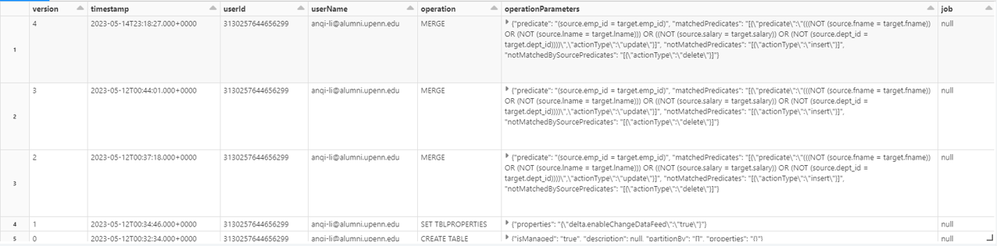
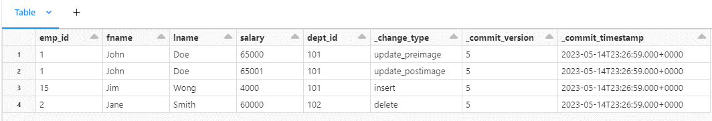
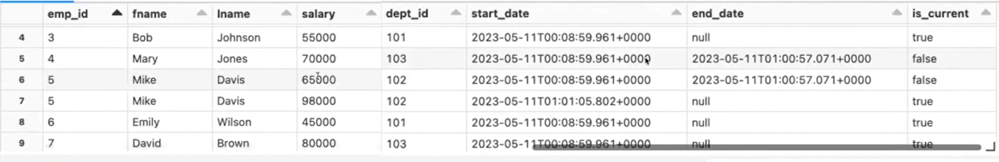

# Data Migration and Change Data Capture 
## **What this project does**
This project focuses on migrating data from MySQL to Databricks for analytics purposes while ensuring data synchronization and maintaining a comprehensive history of data changes. By leveraging the capabilities of Databricks and Delta Lake, this project provides an efficient and scalable solution for tracking and processing data changes. 

## **How this project works**
### Data Migration 
Databricks was connected to the MySQL database using MySQL JDBC driver. Data in MySQL database were then read to Databricks using PySpark direct queries. 
### Change Data Capture 
Tow Slowly Changing Dimension (SCD) tables were implemented to effectively track and manage the changes in data.

First, a SCD Type 1 table was developed using the SQL Merge function. The merge function allows handling insertions, updates, and deletions in a single operation. The SCD 1 table tracks changes in data over time while overwriting the existing data with new values. This mechanism ensures that the most recent information is stored and available for analysis.

Next, the Change Data Feed (CDF) feature in Databricks was leveraged to efficiently track row-level data changes in Data Lakehouse. The CDF of SCD1 table served as the input of SCD2 table to track complete data change history. 

The merge function was utilized again to develop a SCD2 table. In a SCD2 table, whenever a value changed, the current record was closed, and a new record was created with updated data values, accompanied by effective time and expiration time details for accurate time-based analysis. 

The nature of SCD2 table helps enhance future data process performance by processing only row-level changes, creating materialized views for up-to-date analytics, transmitting changes to downstream systems, and maintaining an audit trail of all data modifications.

### Flexibility and Scalability 
To enhance flexibility and scalability, reusable general-purpose functions were developed to create SCD tables. These functions can be leveraged for similar projects in the future, reducing development time and effort.
